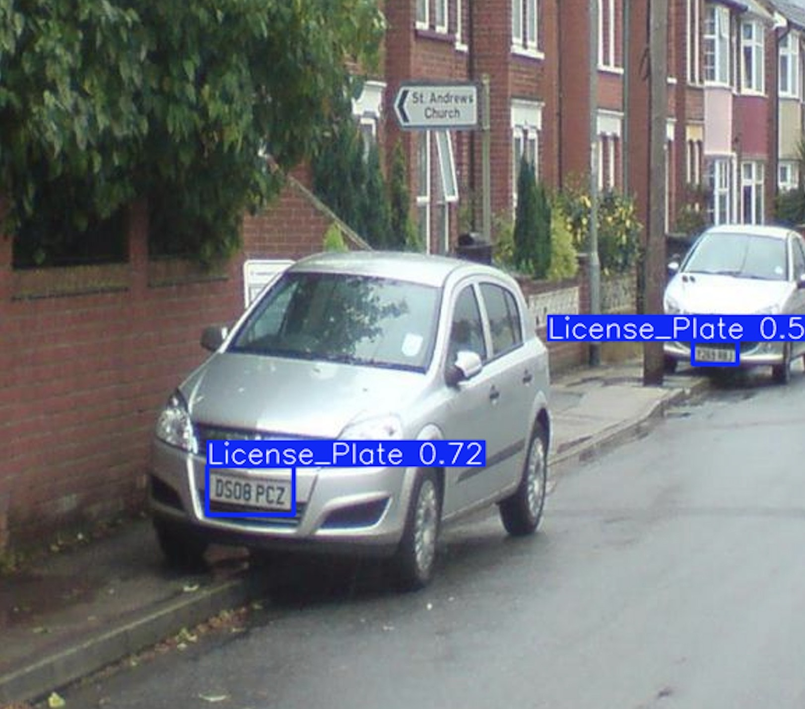
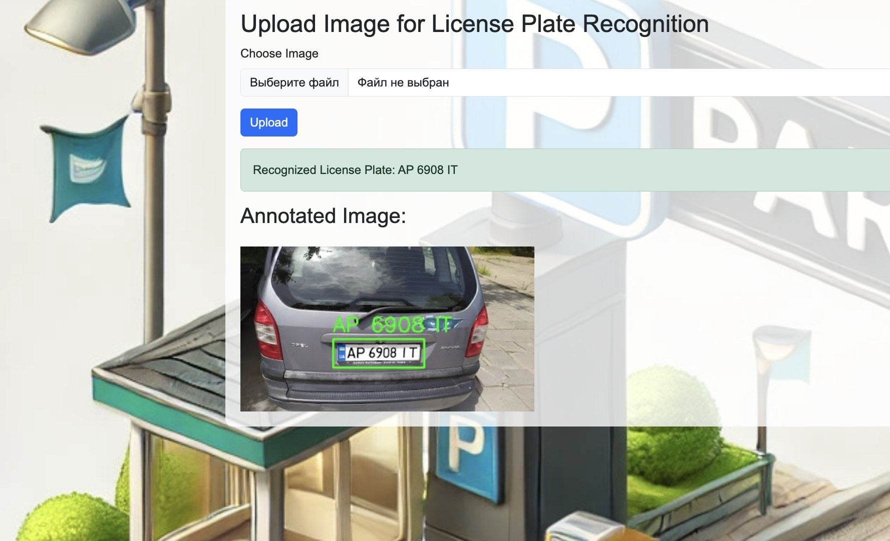
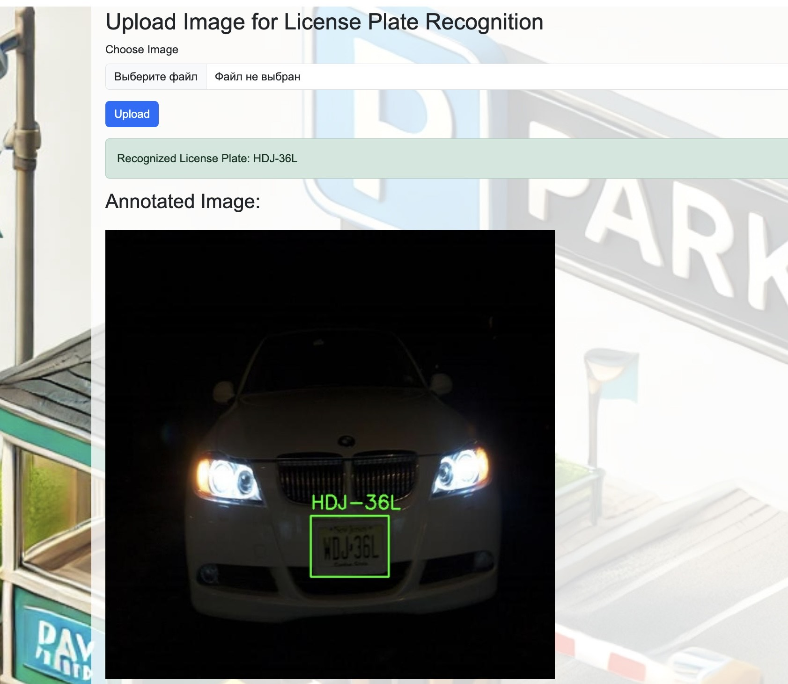

# Parking Management System

## Description

This project is a parking management system that automatically identifies vehicle license plate numbers from images, tracks parking duration for each unique vehicle, and calculates accumulated parking costs. The system includes user account management features, the ability to add and remove vehicles, and generates parking reports.

## License Plate Recognition Technologies

For efficient detection and recognition of vehicle license plates, our project uses advanced computer vision technologies:

1. **License Plate Detection**: The YOLOv8s (You Only Look Once version 8 small) model is used to detect the location of license plates in images. This model provides fast and accurate identification of the area where the license plate is located in a vehicle photograph.



2. **License Plate Text Recognition**: After detecting the license plate, PaddleOCR is used to recognize the actual text of the plate number. This powerful Optical Character Recognition (OCR) library allows for accurate reading of text from the highlighted license plate area.



The combination of these two technologies ensures high accuracy and efficiency in the process of automatic vehicle number identification, which is a key component of our parking management system.



## Functionality

- **User Management**: The administrator can add or remove users, block vehicles.
- **License Plate Recognition**: The system uses computer vision for automatic recognition of vehicle numbers.
- **Parking Time Tracking**: Automatic calculation of parking time for each vehicle.
- **Parking Cost Calculation**: The system calculates parking costs based on the vehicle type.
- **Report Generation**: Ability to export reports in CSV format for the administrator.

## Requirements

- Python 3.11 or higher
- Django 3.5 or higher
- PostgreSQL
- PaddlePaddle (for license plate recognition)
- Other dependencies listed in `pyproject.toml` or `requirements.txt`

# Application Setup

## Setting Up Virtual Environment


### 1. Installation via Docker
This project can be easily set up using Docker. Follow these steps to run the application:

   1. **Ensure that Docker and Docker Compose are installed on your system.**

   2. **Clone the repository**
      ```git clone https://github.com/your-username/your-repo-name.git```
      ```cd``` your-repo-name

   3. **Build and run Docker containers**
      ```docker-compose up --build -d```


### 2. Installation via Conda

   - 1. **Clone the repository**

      ```git clone https://github.com/your-username/your-repo-name.git```
      ```cd``` your-repo-name

   - 2. **Create and activate virtual environment**

      Using Conda:

      - ```conda create -n parking-system python=3.11```
      - ```conda activate parking-system```
      - ```pip install -r requirements.txt```

### 3. Installation via Poetry
   - 1. **Install Poetry (if not already installed)**

      - On Linux and macOS:

      ```curl -sSL https://install.python-poetry.org | python3 -```

      -  On Windows:

      ```Invoke-WebRequest -Uri https://install.python-poetry.org -UseBasicParsing).Content | python -```

      - Add Poetry to your PATH:

      ```export PATH="$HOME/.local/bin:$PATH"```

   - 2. **Clone the repository**

      ```git clone https://github.com/your-username/your-repo-name.git```
      ```cd``` your-repo-name

   - 3. **Install dependencies via Poetry**

      ```poetry install```

   - 4. **Activate virtual environment**

      ```poetry shell```

### 4. Installation via VENV

   - 1. ```python3 -m venv venv```
   - 2. ```source venv/bin/activate```
   - 3. ```pip install -r requirements.txt```

### Additional Instructions for Linux

   - 1. Make sure you have all necessary packages installed for compiling Python dependencies:
      - ```sudo apt-get update```
      - ```sudo apt-get install build-essential libssl-dev libffi-dev python3-dev```

## Database Setup:

1. Use ```example.env``` to create your own ```.env```

2. Use psql to create a PostgreSQL database and user.

3. After installing dependencies, perform database migrations:

   - ```python manage.py makemigrations```
   - ```python manage.py migrate```

3. Create a superuser

   - ```python manage.py createsuperuser```

### Starting the Server

1.  Navigate to the ```parking_system``` directory:  

    ```cd``` and your path to the ```parking_system``` directory

2. Run the server: 

   - ```python manage.py runserver```


# Usage Instructions

##  Authorization

- Go to http://127.0.0.1:8000/admin/ and log in with the superuser account created during setup.

- User and Vehicle Management

- Add new users and vehicles through the admin panel.

- Uploading Images for License Plate Recognition

- Users can upload images of their vehicles, and the system will automatically recognize the license plate and calculate parking time.

- Report Generation

- The administrator can generate a parking report and download it in CSV format through the appropriate interface.

##  Adding a New Vehicle

- Go to the vehicle addition page.
- Fill out the form, selecting the vehicle type from the list (Car, Truck, Motorcycle, Yacht).
- Save the vehicle.
- Viewing Parking Sessions

- Authorized users can view their parking sessions.
- The administrator can view all parking sessions.
- Exporting Reports to CSV

- The administrator can generate a parking report for a specific period and export it in CSV format.

### Common Issues
- Database problems: Ensure that the database connection settings are correct and the database is running